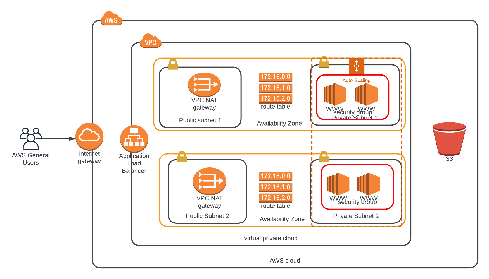

# High-Availability Web Application on AWS

Infrastructure as Code (IaC) project that deploys a production-grade, highly available web application on AWS using CloudFormation. The infrastructure spans multiple Availability Zones with auto scaling, load balancing, and network isolation following AWS Well-Architected Framework principles.

## Architecture



### Architecture Overview

| Layer | Components | Purpose |
|-------|-----------|---------|
| **Networking** | VPC, 2 Public Subnets, 2 Private Subnets | Network isolation across 2 AZs |
| **Internet Access** | Internet Gateway, 2 NAT Gateways, Elastic IPs | Inbound/outbound connectivity |
| **Load Balancing** | Application Load Balancer, Target Group, Listener | Traffic distribution and health checks |
| **Compute** | Auto Scaling Group, Launch Configuration (t3.medium) | Scalable application hosting |
| **Security** | Security Groups (ALB + Web Server), IAM Roles | Least-privilege access control |
| **Storage** | S3 Bucket | Application artifact delivery |

**Traffic Flow:** Users connect through the Internet Gateway to the Application Load Balancer in the public subnets. The ALB forwards requests to EC2 instances running Apache2 in the private subnets. NAT Gateways in each AZ provide outbound internet access for the private instances. Application content is pulled from S3 during instance bootstrap.

## Project Structure

```
.
├── templates/
│   ├── network.yml
│   └── application.yml
├── parameters/
│   └── dev/
│       ├── network.json
│       └── application.json
├── scripts/
│   ├── create-stack.sh
│   ├── update-stack.sh
│   ├── delete-stack.sh
│
├── docs/
│   ├── architecture.png
│   └── architecture.svg
└── README.md
```

**Stack dependency:** The `network` stack must be deployed before `application`, as the application stack imports VPC and subnet references via CloudFormation cross-stack exports.

## Prerequisites

- AWS CLI_V2
- AWS IAM credentials with permissions to create VPC, EC2, ELB, IAM, and CloudFormation resources
- An S3 bucket containing the application artifact (`travel-site.zip`)

## Deployment

### 1. Deploy the Network Stack

Creates the VPC, subnets, internet gateway, NAT gateways, and route tables.

```bash
./scripts/create-stack.sh dev-network templates/network.yml parameters/dev/network.json
```

### 2. Deploy the Application Stack

Creates the load balancer, auto scaling group, security groups, and IAM roles. This stack depends on the network stack outputs.

```bash
./scripts/create-stack.sh dev-webapp templates/application.yml parameters/dev/application.json
```

### 3. Access the Application

After deployment completes, retrieve the application URL from the stack outputs:

```bash
aws cloudformation describe-stacks \
  --stack-name dev-webapp \
  --query "Stacks[0].Outputs[?OutputKey=='WebUrl'].OutputValue" \
  --output text \
  --region us-east-1
```

## Updating Stacks

Modify the template or parameter files, then apply updates:

```bash
./scripts/update-stack.sh dev-network templates/network.yml parameters/dev/network.json
./scripts/update-stack.sh dev-webapp templates/application.yml parameters/dev/application.json
```

## Teardown

Delete stacks in reverse dependency order:

```bash
./scripts/delete-stack.sh dev-webapp
./scripts/delete-stack.sh dev-network
```

## Parameters

### Network Stack (`parameters/dev/network.json`)

| Parameter | Default | Description |
|-----------|---------|-------------|
| `ENV` | `Dev` | Environment prefix applied to all resource names and exports |
| `VpcCIDR` | `10.0.0.0/16` | CIDR block for the VPC |
| `PublicSubnet1CIDRBlock` | `10.0.0.0/24` | CIDR block for public subnet in AZ1 |
| `PublicSubnet2CIDRBlock` | `10.0.1.0/24` | CIDR block for public subnet in AZ2 |
| `PrivateSubnet1CIDRBlock` | `10.0.2.0/24` | CIDR block for private subnet in AZ1 |
| `PrivateSubnet2CIDRBlock` | `10.0.3.0/24` | CIDR block for private subnet in AZ2 |

### Application Stack (`parameters/dev/application.json`)

| Parameter | Default | Description |
|-----------|---------|-------------|
| `ENV` | `Dev` | Environment prefix (must match the network stack) |

## Cross-Stack References

The application stack consumes the following exports from the network stack:

| Export Name | Resource |
|-------------|----------|
| `${ENV}-VPCID` | VPC ID |
| `${ENV}-PUB-SUBNETS` | Public subnet IDs (comma-separated) |
| `${ENV}-PRIV-SUBNETS` | Private subnet IDs (comma-separated) |
| `${ENV}-PUBLIC-SUBNET1` | Public Subnet 1 ID |
| `${ENV}-PUBLIC-SUBNET2` | Public Subnet 2 ID |
